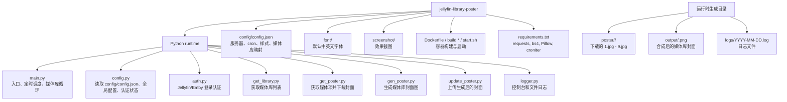
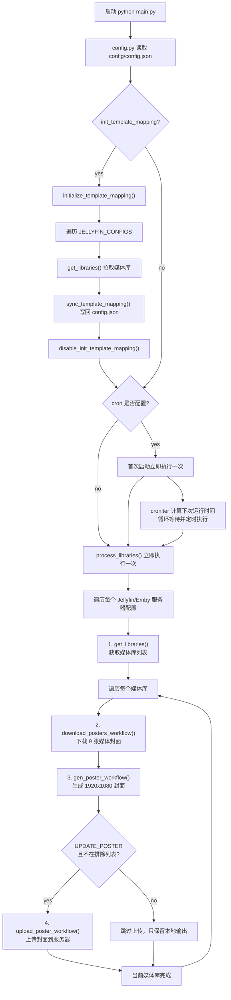
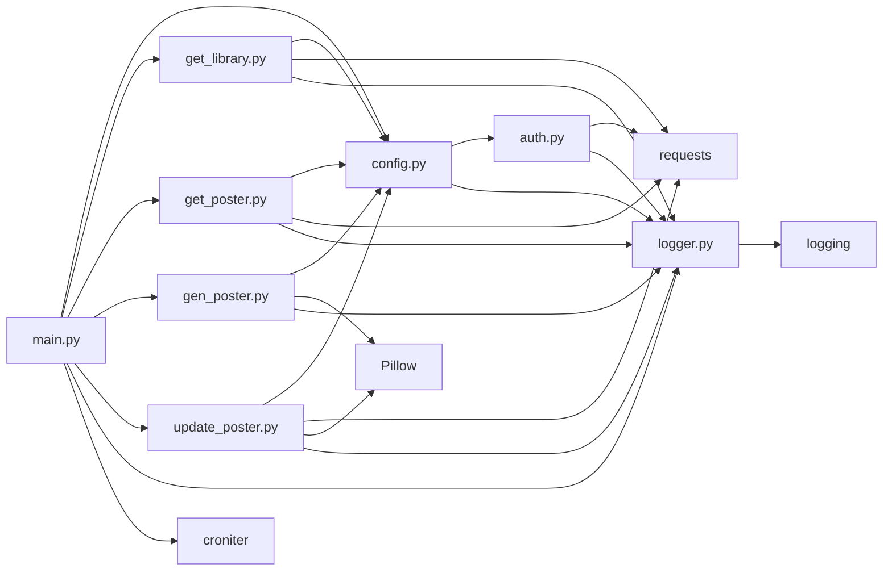
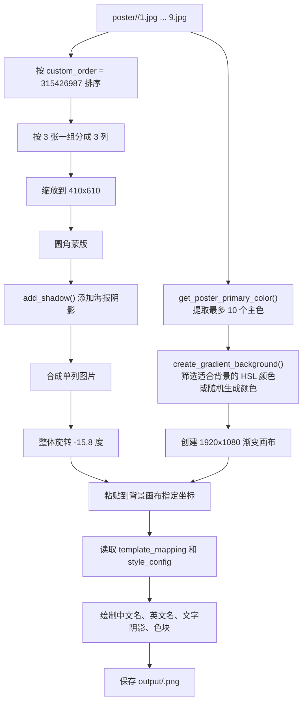
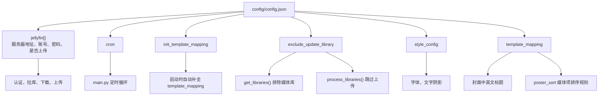
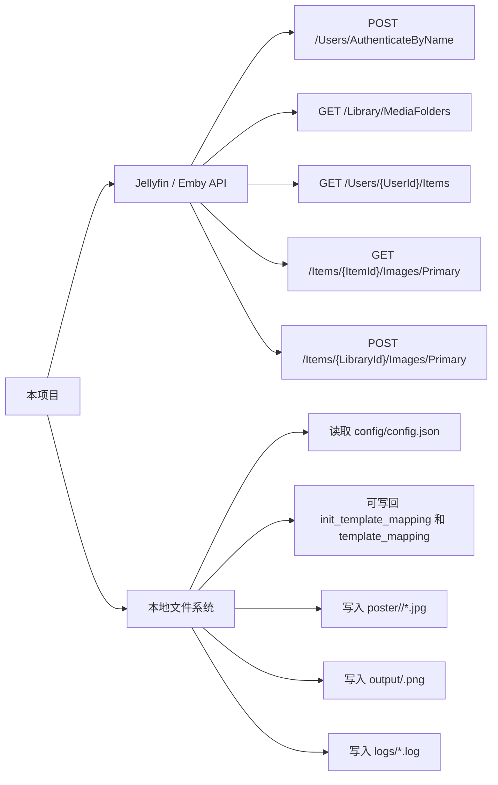

# Project Visualization

这份文档把 `jellyfin-library-poster` 的代码结构、运行流程和数据流画出来，方便快速理解项目。

## 1. 项目地图



## 2. 主执行流程



## 3. 模块依赖图



## 4. 数据流

```mermaid
flowchart LR
    cfg["config/config.json"] --> config["config.py"]
    config --> serverCfg["JELLYFIN_CONFIGS / JELLYFIN_CONFIG"]
    serverCfg --> auth["auth.authenticate()"]
    auth --> token["ACCESS_TOKEN / USER_ID"]

    token --> libApi["GET /Library/MediaFolders"]
    libApi --> libraries["媒体库列表"]

    libraries --> itemApi["GET /Users/{UserId}/Items"]
    itemApi --> items["媒体项列表"]
    items --> imageApi["GET /Items/{ItemId}/Images/Primary"]
    imageApi --> posterFiles["poster/<library>/1.jpg ... 9.jpg"]

    posterFiles --> generator["gen_poster_workflow()"]
    cfg --> style["template_mapping / style_config"]
    style --> generator
    generator --> output["output/<library>.png"]

    output --> uploadCheck{"update_poster enabled?"}
    uploadCheck -- yes --> uploadApi["POST /Items/{LibraryId}/Images/Primary"]
    uploadCheck -- no --> localOnly["仅本地保存"]
```

## 5. 封面生成内部流程



## 6. 配置影响范围



## 7. 核心职责速览

| 文件 | 职责 | 关键函数 |
| --- | --- | --- |
| `main.py` | 程序入口、cron 调度、多服务器和多媒体库循环 | `main`, `process_libraries`, `initialize_template_mapping` |
| `config.py` | 加载 JSON 配置、维护当前服务器认证状态、同步媒体库映射 | `get_auth_info`, `sync_template_mapping`, `get_template_config` |
| `auth.py` | 调用 Jellyfin/Emby 认证接口，获取 `User.Id` 和 `AccessToken` | `authenticate` |
| `get_library.py` | 拉取媒体库列表，并按排除配置过滤 | `get_libraries` |
| `get_poster.py` | 拉取媒体项、筛选有封面的项目、下载封面图 | `download_posters_workflow`, `get_items`, `download_all_posters` |
| `gen_poster.py` | 使用 Pillow 生成最终封面图 | `gen_poster_workflow`, `create_gradient_background`, `get_poster_primary_color` |
| `update_poster.py` | 读取输出图片并上传回 Jellyfin/Emby | `upload_poster_workflow`, `upload_image` |
| `logger.py` | 彩色控制台日志和按日期写入文件日志 | `get_logger`, `get_module_logger` |

## 8. 外部交互边界


